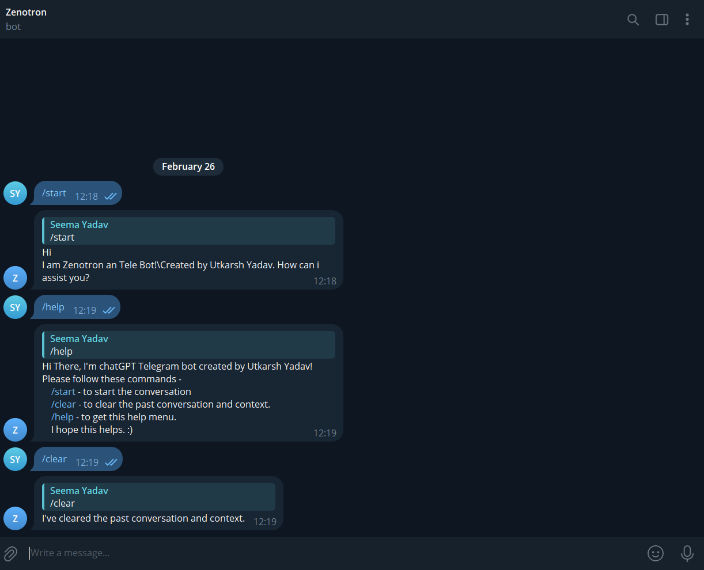
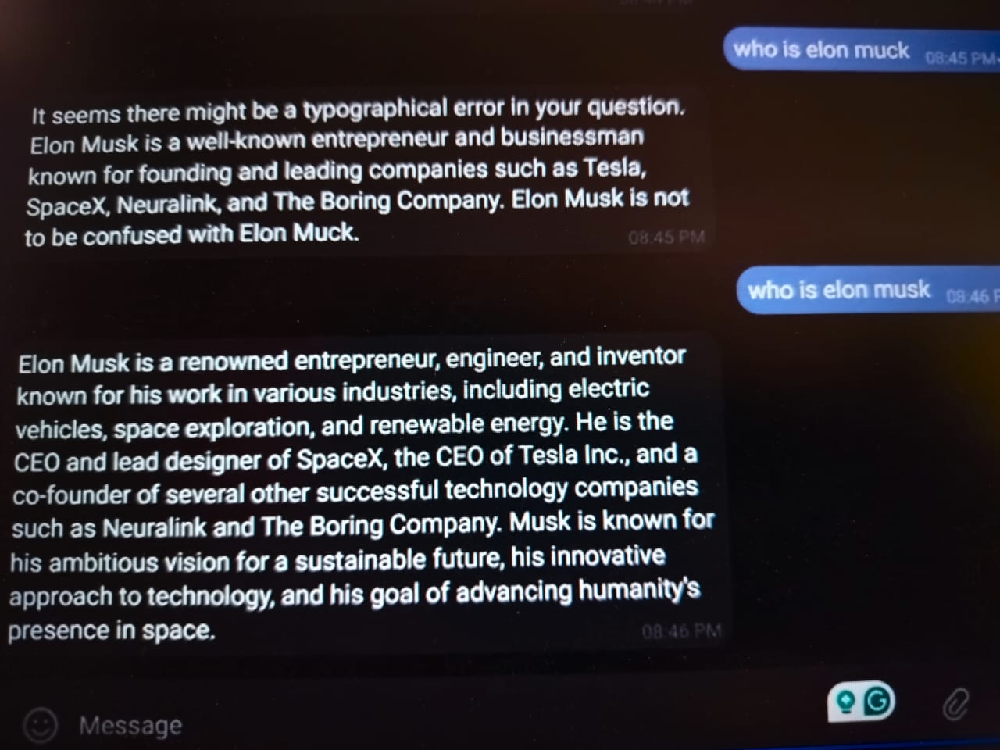

# Zenotron

Zenotron is a Telegram bot that interacts with users using OpenAI's API. This bot echoes messages and can be extended to provide AI-based responses.

## Features
- Echoes messages sent by users.
- Uses OpenAI API for AI-based responses.
- Easy to set up and deploy.

## Folder Structure
```
Zenotron/
│-- research/
│   └── tele_echo_gbot.py  # Main bot script
│-- .gitignore             # Ignoring unnecessary files
│-- requirements.txt       # Required Python dependencies
│-- README.md              # Project documentation
│-- telebot.py             # Additional bot functionality
```

## Setup Guide

### 1. Clone the Repository
```bash
git clone https://github.com/your-username/Zenotron.git
cd Zenotron
```

### 2. Create a Virtual Environment 
```bash
on windows
conda create --name venev python=3.10 -y
conda activate venev
```

### 3. Install Dependencies
```bash
pip install -r requirements.txt
```

### 4. Set Up Environment Variables
Create a `.env` file in the project root and add:
```ini
TELEGRAM_BOT_TOKEN=your-telegram-bot-token
OPENAI_API_KEY=your-openai-api-key
```
⚠ **Never share your API keys publicly!**

### 5. Run the Bot
```bash
python telebot.py
```

## How to Create a Telegram Bot
1. Open Telegram and search for `@BotFather`.
2. Start a chat and type `/newbot`.
3. Follow the instructions and get your **bot token**.
4. Copy the token and paste it into your `.env` file.

## Screenshots
| Before Summarization | After Summarization |
|------------------|----------------|
|  |  |

## Contributing
Feel free to contribute by opening issues or submitting pull requests.

## License
This project is licensed under the MIT License.


